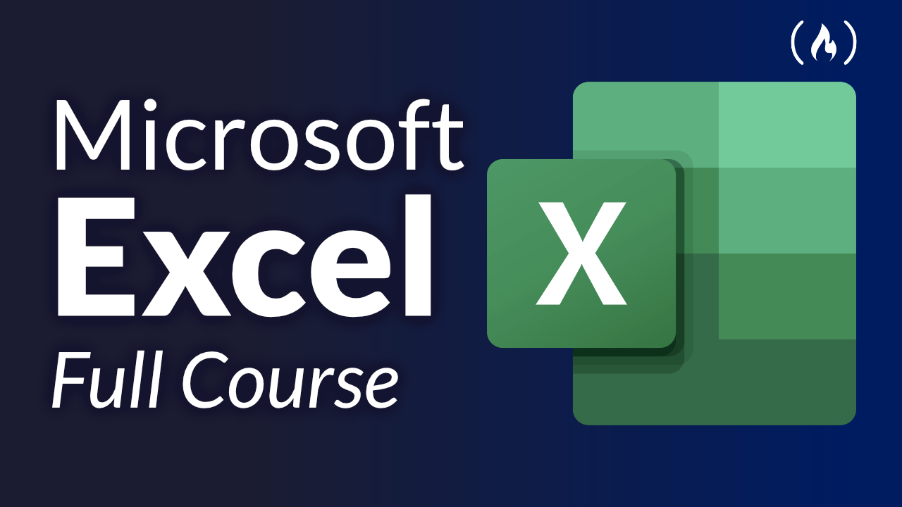

# FreeCodeCamp YouTube Channel

Are you passionate about coding? Do you dream of mastering programming languages, web development, and data science? Look no further than the **FreeCodeCamp YouTube Channel** – your one-stop destination for comprehensive, accessible, and free coding tutorials.

## Why FreeCodeCamp?

FreeCodeCamp is a global community of coders, dedicated to providing high-quality educational resources for anyone interested in learning to code. Their YouTube channel is an extension of this mission, offering a treasure trove of video tutorials, coding challenges, and real-world projects.

## A Wealth of Knowledge

With over **1.5 million subscribers** and counting, FreeCodeCamp's YouTube channel boasts an extensive library of coding tutorials covering a wide range of topics, including:

1. **HTML & CSS**: Learn the foundations of web development and create stunning websites.
2. **JavaScript**: Dive into the world's most popular programming language and unlock its full potential.
3. **Data Science**: Discover the secrets of data analysis, visualization, and machine learning.
4. **Responsive Web Design**: Master the art of building websites that adapt to different devices.
5. **Algorithms & Data Structures**: Develop problem-solving skills and sharpen your coding abilities.
6. **Full Stack Development**: Gain the skills to build dynamic web applications from start to finish.

## Engaging and Interactive Content

### I have collected some most interactive contents from FreeCodeCamp below : 

#### Build a Portfolio Website

#### Git and GitHub Crash Course

#### HTML + CSS

The FreeCodeCamp YouTube channel stands out for its engaging and interactive content. Each video is meticulously crafted, offering clear explanations, real-time coding demonstrations, and practical examples. The presenters are experienced developers and educators, ensuring the information is accurate, up-to-date, and accessible to learners of all levels.

Check out these videos to get a taste of FreeCodeCamp's instructional style:

 ***You can click on the image to watch the full video :*** 

## Learning Made Fun

Learning to code doesn't have to be dull and monotonous. FreeCodeCamp injects fun and excitement into their tutorials, making the learning process enjoyable. From coding challenges to gamified projects, you'll find yourself immersed in a world where learning is an adventure.

## A Supportive Community

One of the greatest strengths of FreeCodeCamp is its thriving community. With thousands of learners actively engaging in discussions, sharing insights, and collaborating on projects, you'll find a supportive and encouraging environment. The FreeCodeCamp YouTube channel serves as a gateway to this vibrant community, where you can connect with like-minded individuals and expand your network.

## How to Get Started?

Getting started with FreeCodeCamp is simple. Follow these steps:

1. Visit the [FreeCodeCamp YouTube Channel](https://www.youtube.com/freecodecamp).
2. Explore their video library and find topics that interest you.
3. Subscribe to the channel to stay updated with new releases.
4. Dive into the tutorials and start coding!

## Conclusion

The FreeCodeCamp YouTube channel is a game-changer for anyone seeking to learn coding. With its vast array of tutorials, engaging content, and supportive community, it's the perfect platform to embark on your coding journey. So why wait? Unlock the power of learning with FreeCodeCamp today!